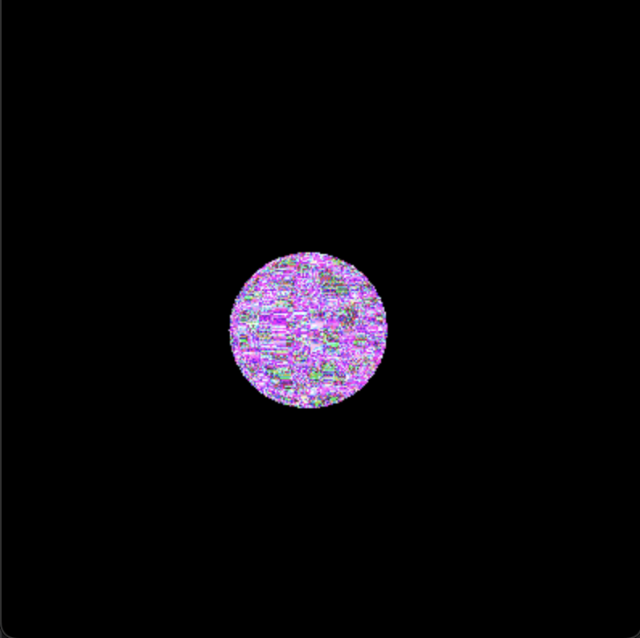
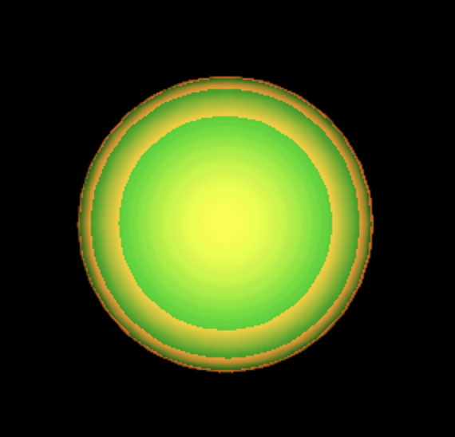
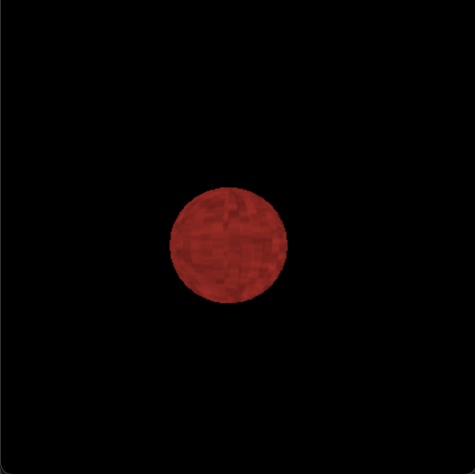
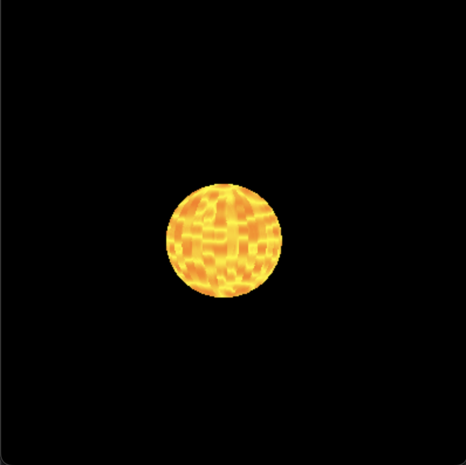
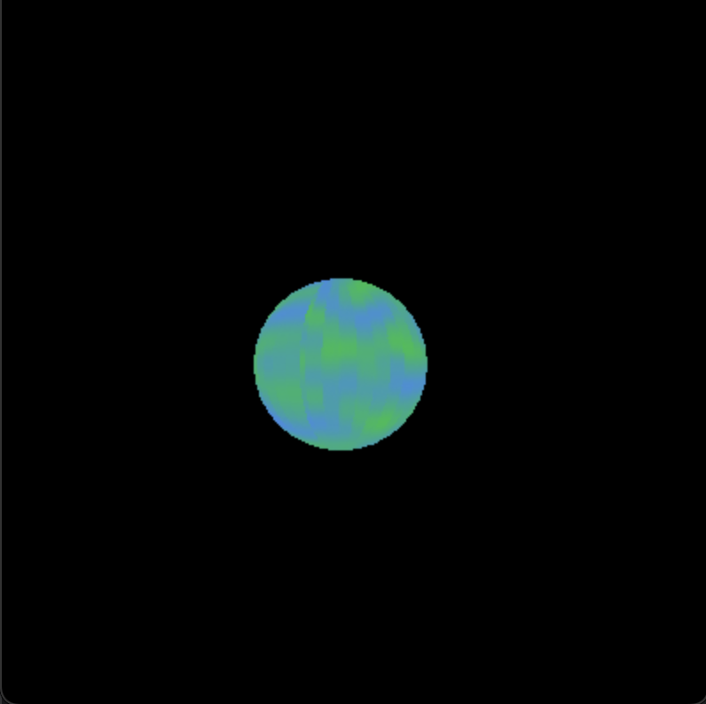

# Lab04-CC2018
Laboratorio 04, Gráficas por computadora. Creación de shaders para diseñar 3 cuerpos celestes y crearlos con software renderer.

## ¿Cómo ejecutarlo?
### Para usuarios de MacOS
El código ya tiene implementado un _shortcut_ por lo que solo debes ejecutar el siguiente comando:
```
./run.sh
```

### Para usuarios de Windows
Ejecuta los comandos en el siguiente orden
```
cmake -G "Unix Makefiles" -S . -B build
cd build && make
call PROJECT.exe
```

### Resultado:





